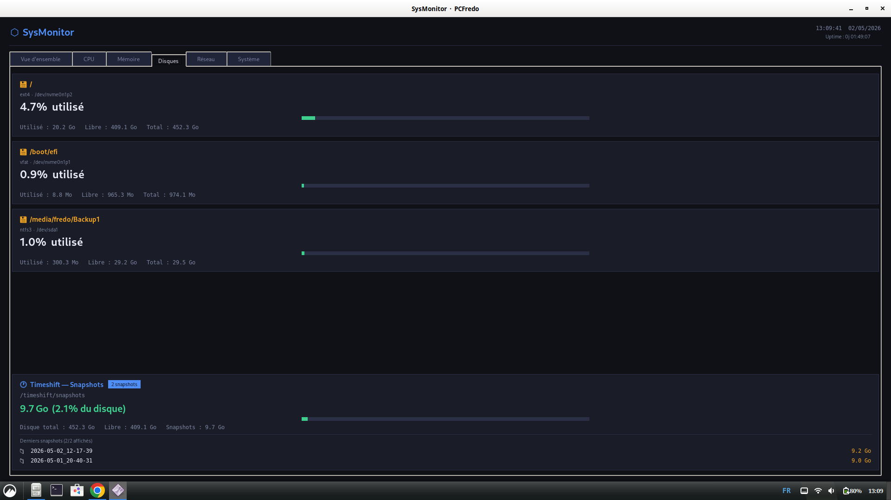

# 🖥️ SysMonitor

> Tableau de bord système en temps réel — interface graphique Python/Tkinter pour Linux


---

## 📋 Présentation

**SysMonitor** est un dashboard de monitoring système léger, sans navigateur et sans serveur, entièrement construit avec Python et Tkinter. Il affiche en temps réel les métriques essentielles de votre machine dans une interface sombre organisée en onglets.

Conçu pour tourner en permanence sur un bureau Linux, il est particulièrement adapté aux systèmes **Zorin OS**, **Debian** et leurs dérivés.

---

## ✨ Fonctionnalités

### 🗂️ 6 onglets de monitoring

| Onglet | Contenu |
|---|---|
| **Vue d'ensemble** | Résumé compact CPU / RAM / Disque / Réseau en un coup d'œil |
| **CPU** | Utilisation globale + par cœur, fréquence actuelle / min / max |
| **Mémoire** | RAM et SWAP avec détail buffers, cache, disponible |
| **Disques** | Toutes les partitions montées, détectées automatiquement |
| **Réseau** | Débit instantané upload/download, totaux, liste des interfaces |
| **Système** | Infos machine, OS, architecture, Python, températures capteurs |

### 🎯 Points forts

- **Barres de progression custom** colorées dynamiquement (🟢 < 60% · 🟡 < 85% · 🔴 ≥ 85%)
- **Débit réseau instantané** calculé entre deux mesures (Ko/s, Mo/s auto-adapté)
- **Uptime** formaté `j hh:mm:ss` affiché en en-tête
- **Températures CPU** via `psutil.sensors_temperatures()` si disponible
- **Timeshift Snapshots** — quota, taille totale et liste des 5 derniers snapshots avec taille individuelle
- **Rafraîchissement intelligent** : métriques système toutes les **1,5 s**, Timeshift toutes les **60 s** (thread séparé, anti-chevauchement)
- **Thème sombre** professionnel (#0f1117 / #1a1d27), polices Segoe UI + Consolas

---

## 📸 Capture d'écran



---

## ⚙️ Installation

### Prérequis

**Debian 13 (Trixie) / Zorin OS / Ubuntu :**

```bash
sudo apt install python3 python3-tk python3-psutil
```

> Les modules `platform`, `datetime`, `threading`, `time`, `os`, `shutil` et `subprocess` font partie de la bibliothèque standard Python — aucune installation supplémentaire requise.

### Cloner le dépôt

```bash
git clone https://github.com/votre-utilisateur/sysmonitor.git
cd sysmonitor
```

### Lancer

```bash
python3 dashboard_systeme.py
```

---

## 🔐 Configuration Timeshift (optionnel)

La section **Timeshift Snapshots** lit `/timeshift/snapshots` qui appartient à `root`. Pour afficher les données sans être root, ajoutez une règle sudoers :

```bash
sudo visudo -f /etc/sudoers.d/sysmonitor
```

Collez la ligne suivante en remplaçant `votre_utilisateur` par votre nom d'utilisateur :

```
votre_utilisateur ALL=(ALL) NOPASSWD: /usr/bin/ls, /usr/bin/du, /usr/bin/test
```

Sauvegardez avec `Ctrl+X` → `Y` → `Entrée`.

> Si cette règle est absente, la carte Timeshift affichera un message d'erreur en rouge — le reste du dashboard fonctionne normalement.

---

## 🗂️ Structure du projet

```
sysmonitor/
├── dashboard_systeme.py   # Script principal
└── README.md              # Ce fichier
```

---

## 🛠️ Dépendances

| Package | Rôle | Source |
|---|---|---|
| `python3` | Interpréteur Python 3.13 | `apt` |
| `python3-tk` | Interface graphique Tkinter | `apt` |
| `python3-psutil` | Lecture métriques système | `apt` |
| `subprocess` | Appels `sudo du`/`ls` pour Timeshift | stdlib |

---

## 🔄 Fréquences de rafraîchissement

| Métrique | Intervalle |
|---|---|
| CPU, RAM, Réseau, Disques | 1,5 secondes |
| Timeshift Snapshots | ~60 secondes |
| Premier scan Timeshift | 3 secondes après démarrage |

---

## 🤝 Contribution

Les contributions sont les bienvenues ! N'hésitez pas à ouvrir une *issue* ou une *pull request*.

1. Forkez le projet
2. Créez votre branche (`git checkout -b feature/ma-fonctionnalite`)
3. Commitez vos changements (`git commit -m 'Ajout de ma fonctionnalité'`)
4. Poussez la branche (`git push origin feature/ma-fonctionnalite`)
5. Ouvrez une Pull Request

---

## 📄 Licence

Ce projet est sous licence **MIT** — voir le fichier [LICENSE](LICENSE) pour les détails.

